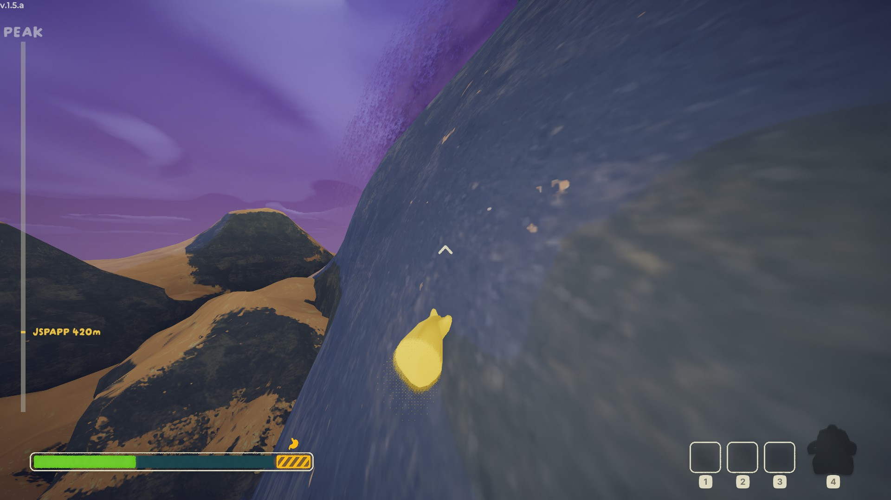
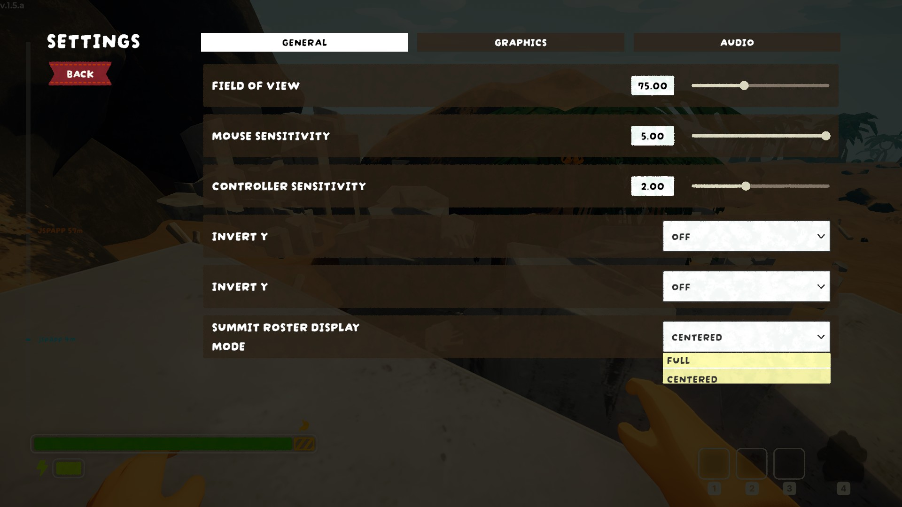

# Summit Roster

Simple and unobtrusive view to show you and your friends' progress.

## Installation
The `plugins/` folder can be dropped right into `PEAK/BepInEx/` (or the contents of `plugins/` can be moved into `PEAK/Bepinex/plugins/`, same thing.)

## Usage
Draws a component on the screen that shows characters' name and height.

### Modes
#### Full
See the full scale of the mountain. Things will look cramped climbing together with a group of friends, but gives a good view of your progress in total.
#### Centered
Shows a relative view of the scouts around you, with logarithmic scaling. That means it spreads out the people closest to you so you can see who the real surivalists are: anyone whose name is clumped up is forgetting Rule 0!

### Settings
Mode can be adjusted from the Settings page and updates in realtime.

## Building

# Building with Visual Studio

To build this plugin using Visual Studio:

1. Before opening the `SummitRoster.sln` solution file in Visual Studio you will need to open the `SummitRoster/SummitRoster.csproj` file in a text editor and update the paths for the following DLLs to point to their correct locations on your system:
	- Assembly-CSharp
	- netstandard
	- PhotonRealtime
	- PhotonUnityNetworking
	- Unity.Localization
	- Unity.TextMeshPro
	- UnityEngine.UI
	- Zorro.Settings.Runtime
2. Now you can open the `SummitRoster.sln` project file in Visual Studio.
3. Build the project. The output DLL can be found in the build directory (e.g., `bin/Debug` or `bin/Release`).
4. Copy the built DLL to your `PEAK/BepInEx/plugins/` folder as described above.

If you encounter missing references, ensure you have the required DLLs from your game or development environment and update the reference paths accordingly in the project file.
